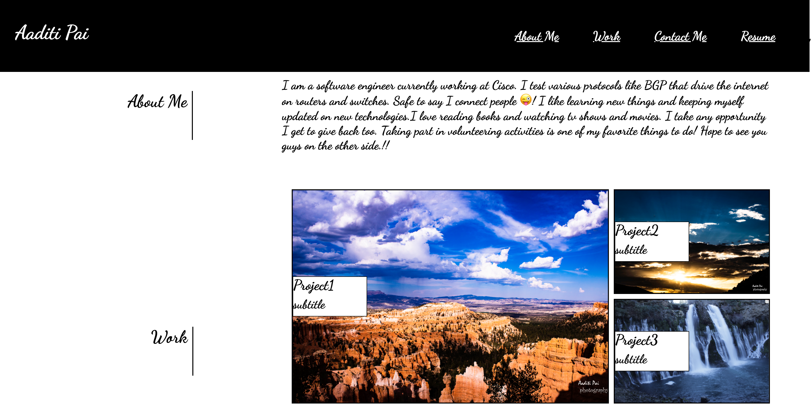

# MY PORTFOLIO

## Introducing "ME".. includes a short intro, my projects and my contact details.

### Snapshots of my page
#### My name and pic and links to the rest of the page

#### Intro to me and links to my projects
##### I am a software engineer currently working at Cisco. I test various protocols like BGP that drive the internet on routers and switches.Safe to say I connect people &#128540;! I like learning new things and keeping myself updated on new technologies.I love reading books and watching tv shows and movies.I take any opportunity I get to give back too. Taking part in volunteering activities is one of my favorite things to do! Hope to see you guys on the other side.!!
            

#### links to more projects and my contact details. You can contact me at aaditigp@usc.edu.

